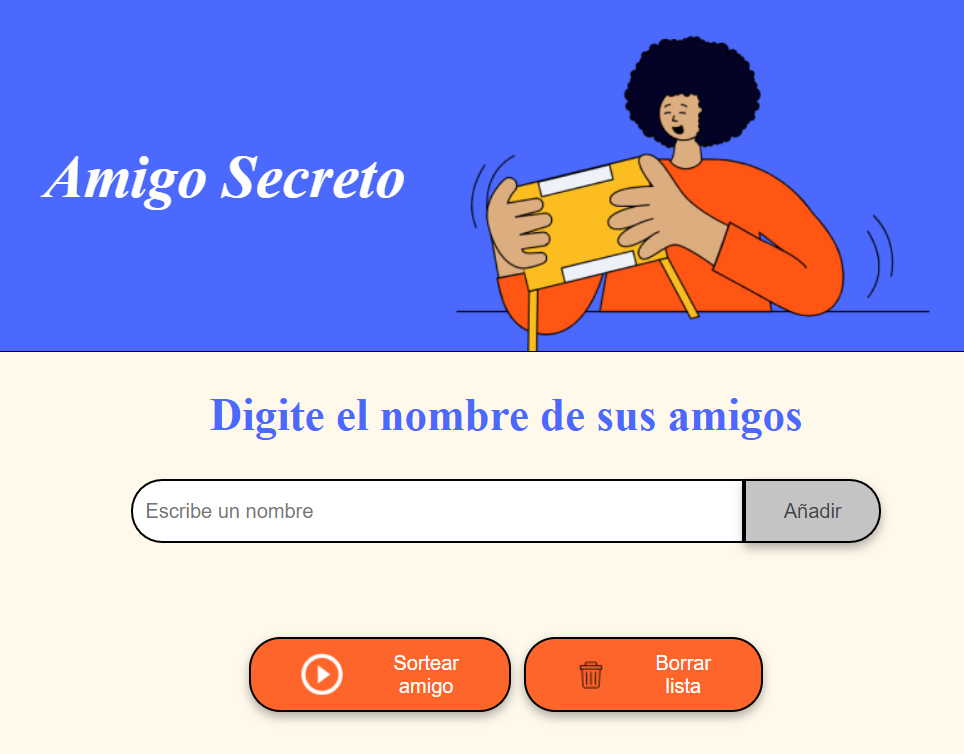
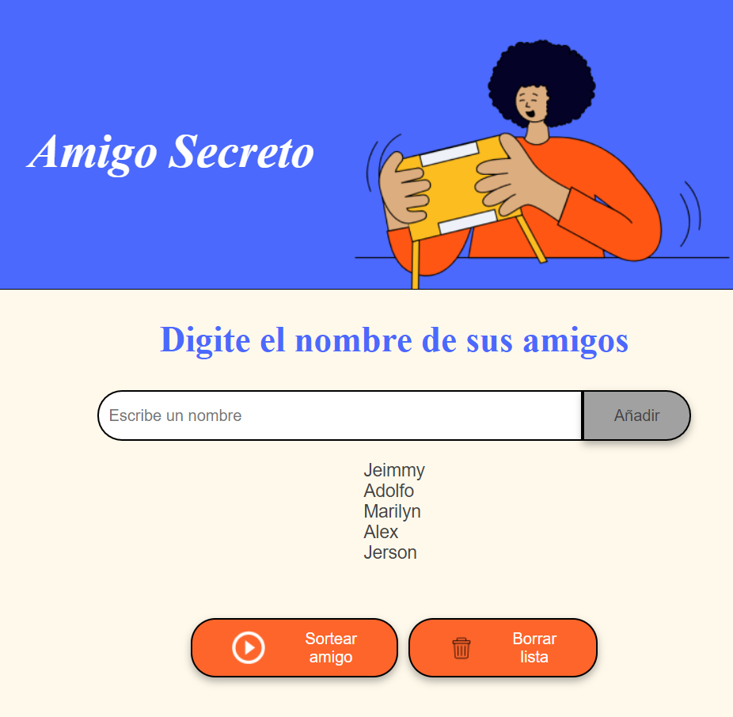
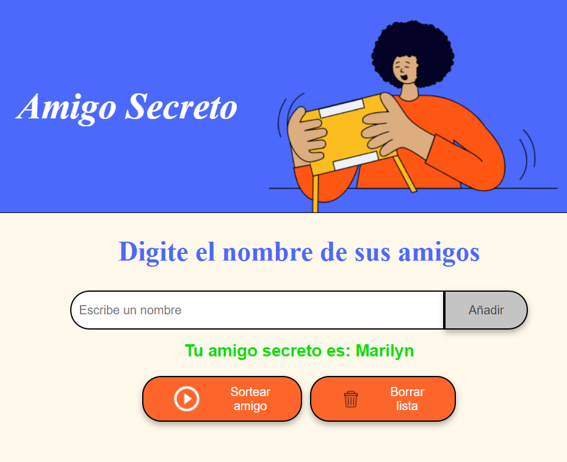
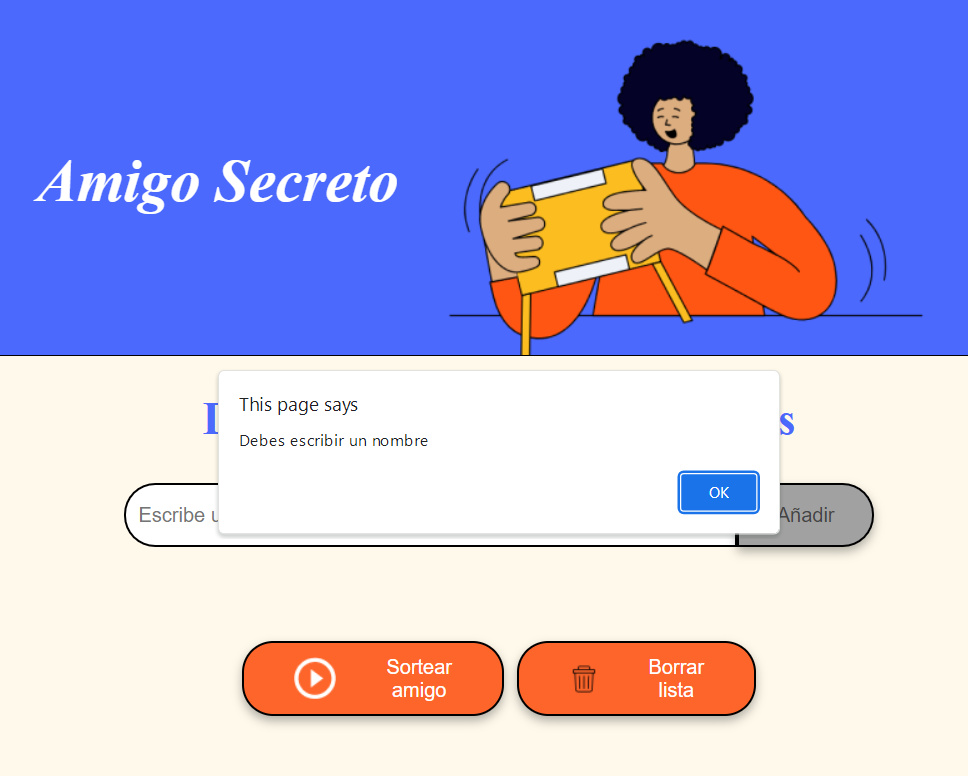
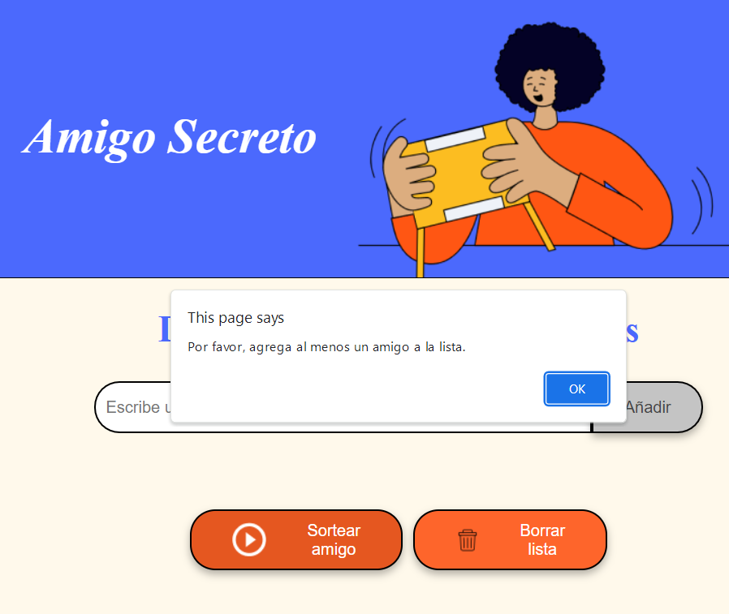
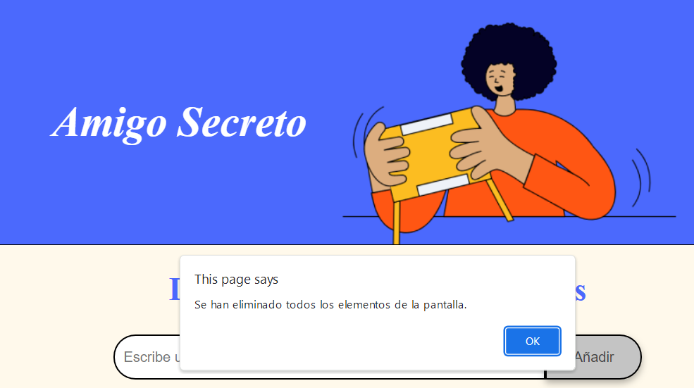

<h1>Amigo Secreto 🎁</h1>
    
¡Bienvenido a <strong>Amigo Secreto</strong>! Esta es una aplicación web sencilla que te permite organizar un juego de amigo secreto. Puedes agregar los nombres de tus amigos, verlos en una lista y sortear al azar quién le toca a quién.

<h2>Características ✨</h2>
    <ul>
        <li><strong>Agregar nombres</strong>: Ingresa los nombres de tus amigos y se mostrarán en una lista.</li>
        <li><strong>Sortear</strong>: Al hacer clic en "Sortear amigo", se selecciona un nombre al azar de la lista.</li>
        <li><strong>Interfaz intuitiva</strong>: Diseño simple y fácil de usar.</li>
        <li><strong>Validación</strong>: Si intentas agregar un nombre vacío, se mostrará una alerta.</li>
        <li><strong>Ocultar lista</strong>: Al sortear, la lista de nombres se oculta para mantener el secreto.</li>
        <li><strong>Borrar lista</strong>: Tienes la opción de comenzar una nueva lista de amigos para sortear.</li>
    </ul>

<h2>Cómo usar 🚀</h2>
    <ol>
        <li><strong>Agregar nombres</strong>:
            <ul>
                <li>Escribe el nombre de un amigo en el campo de texto.</li>
                <li>Haz clic en "Añadir" para agregarlo a la lista.</li>
            </ul>
        </li>
        <li><strong>Sortear</strong>:
            <ul>
                <li>Una vez que hayas agregado todos los nombres, haz clic en "Sortear amigo".</li>
                <li>¡El nombre del amigo secreto aparecerá en la pantalla!</li>
            </ul>
        </li>
        <li><strong>Reiniciar</strong>:
            <ul>
                <li>Si deseas agregar más nombres después de sortear, simplemente escribe un nuevo nombre y haz clic en "Añadir". La lista de nombres volverá a mostrarse.</li>
            </ul>
        </li>
        <li><strong>Borrar lista</strong>:
            <ul>
                <li>Si deseas comenzar un sorteo con nuevos nombres, borra la lista. Comienza nuevamente con el juego.</li>
            </ul>
        </li>
    </ol>
<h2>Requisitos 📋</h2>
    <ul>
        <li>Navegador web (Chrome, Firefox, Edge, Safari, etc.).</li>
        <li>Conexión a Internet (solo para cargar fuentes de Google Fonts).</li>
    </ul>

<h2>Instalación 🛠️</h2>
    <ol>
        <li>Clona este repositorio o descarga los archivos.
            <pre><code>git clone https://github.com/tu-usuario/amigo-secreto.git</code></pre>
        </li>
        <li>Abre el archivo <code>index.html</code> en tu navegador.</li>
        <li>¡Listo! Ya puedes usar la aplicación.</li>
    </ol>

<h2>Estructura del proyecto 📂</h2>
    <pre>
amigo-secreto/
│
├── index.html          # Archivo principal de la aplicación
├── style.css           # Estilos CSS para la interfaz
├── app.js              # Lógica de la aplicación en JavaScript
├── assets/             # Carpeta para imágenes y recursos
│   └── amigo-secreto.png
└── README.md           # Este archivo
    </pre>

<h2>Tecnologías utilizadas 💻</h2>
    <ul>
        <li><strong>HTML</strong>: Estructura de la página web.</li>
        <li><strong>CSS</strong>: Estilos y diseño de la interfaz.</li>
        <li><strong>JavaScript</strong>: Lógica para agregar nombres, sortear y actualizar la interfaz.</li>
        <li><strong>Repositorio ORACLE ONE</strong>: Fuentes del diseño.</li>
    </ul>

<h2>Capturas de pantalla 📸</h2>
<h3>Pantalla principal</h3>
    

<h3>Lista de nombres</h3>
    

<h3>Resultado del sorteo</h3>
    

<h3>Alerta nombre por ingresar vacío</h3>
    

<h3>Alerta lista de amigos vacía</h3>
    
    
<h3>Alerta reinicio de juego, datos borrados</h3>
    
        
  <h2>Contribuir 🤝</h2>
    
¡Las contribuciones son bienvenidas! Si deseas mejorar este proyecto, sigue estos pasos:

    <ol>
        <li>Haz un fork del repositorio.</li>
        <li>Crea una rama con tu nueva funcionalidad (<code>git checkout -b nueva-funcionalidad</code>).</li>
        <li>Genera peticiones de cambio desde GitHub.</li>
        <li>Haz commit de tus cambios (<code>git commit -m 'Agrega nueva funcionalidad'</code>).</li>
        <li>Haz push a la rama (<code>git push origin nueva-funcionalidad</code>).</li>
        <li>Abre un Pull Request.</li>
    </ol>

<h2>Referencia 📄</h2>
    
Este proyecto está bajo la tutela de <strong>ORACLE ONE</strong>. Del desafío <strong>Challenge Amigo Secreto</strong>".

<h2>Autor ✒️</h2>
    <ul>
        <li><strong>Jeimmy Eche</strong></li>
        <li>GitHub: <a href="https://github.com/Jeimmy12">JeimmyEche</a></li>
    </ul>

  

    
¡Gracias por visitar mi proyecto Desafío <strong>Amigo Secreto</strong>! 🎉 Este es el reto juego de amigo secreto. GRACIAS ORACLE ONE 😊

